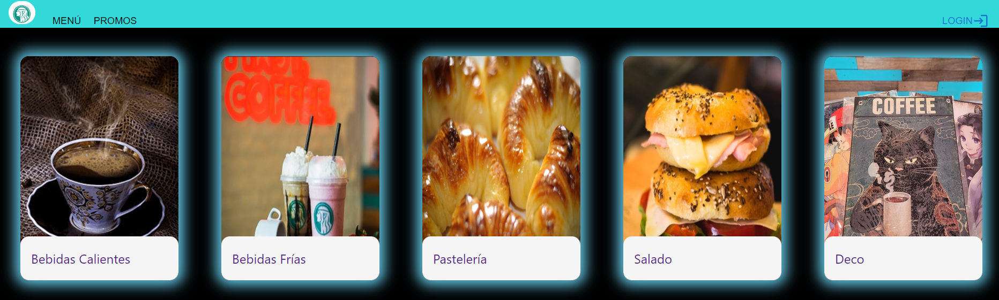
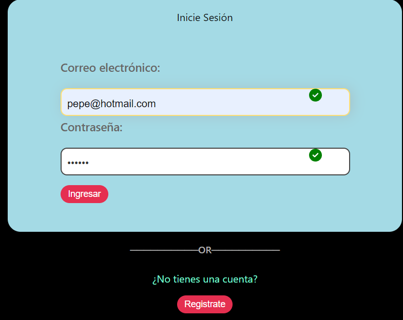
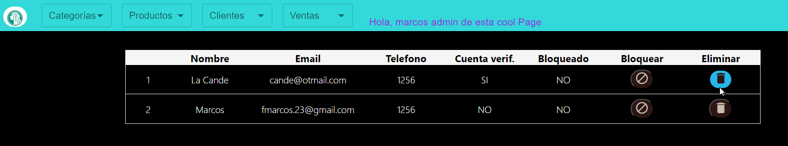
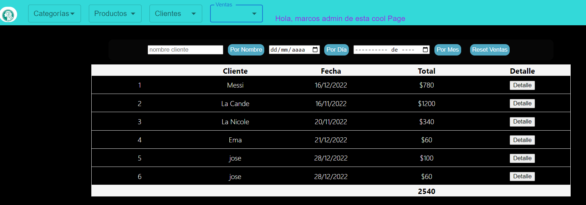
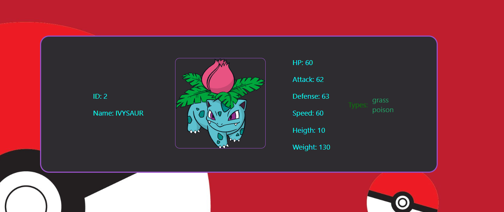
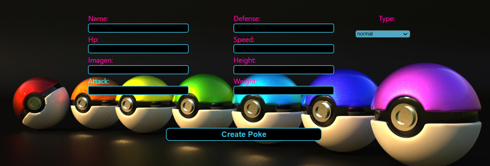
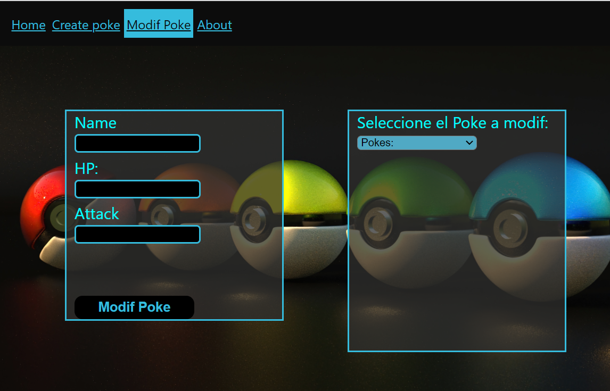

<h1 align="center">Hi 👋, I'm Marcos</h1>
<h2 align="center">Full Stack Developer from Argentina to :earth_americas:</h2>
<h5>Soy un programador full stack con experiencia en el diseño, desarrollo y mantenimiento de aplicaciones web.</h5>

Poseo habilidades tanto del lado del servidor como del cliente, en las siguites herramientas, <b>HTML, CSS, JavaScript, React y Redux, Boostrap, manejo de paquetes (NPM), Node js, Express, SQL, MongoDB, Postman, Git, integracion de APIs.</b>
Estoy en proceso de aprendisaje de TypeScript, PHP, Docker, y proximamente Python.
Me describo como un apacionado por las últimas tendencias en tecnología, me gusta trabajar en equipo, afrontar nuevos desafios, y crear soluciones innovadoras y escalables.

<h3 align="left">Connect with me:</h3>

📫 fmarcos_23@hotmail.com

<h3 align="left">Languages and Tools:</h3>
<h4 align="left">Javascript - Html - CSS - ReactJS - Redux - NodeJS - Postgress - Express - Mongo DB - SQL - TypeScritp</h4>

           

&nbsp;

## My proyects:
<h3>App Web Responsive (E-commerce) para un Café</h3>
Posee Vista para Cliente(no registrado) - Cliente(registrado) - Adiministradores - Mercadopago - Envio de mail
  
Landing

  
Opciones del Menú

  
Menú Bebidas Calientes

  
Login  

  
Vista - Funcionalidades Admin
Muestra Clientes

  
Ventas

  
Productos

  
Vista Cliente(puede editar sus datos, pass, ver compras)

  
  
<h3>App Web - Motos Peralta Ramos </h3>
El cliente pidió solo Landing - que sea lo más directo para la muetra de los productos
  

<video src="./fotos/mpr1.mp4" controls autoplay loop muted ></video>
<video src="./fotos/mpr2.mp4" controls autoplay loop muted ></video>

  
  
<h3>Proyecto Individual Final Bootcamp Soy Henry -App Web con filtros, paginación, conexión con Api externa-</h3>
  

  

  

  
